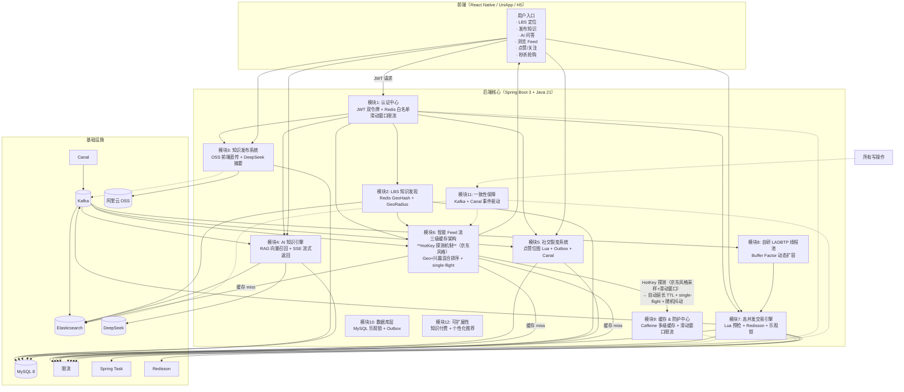
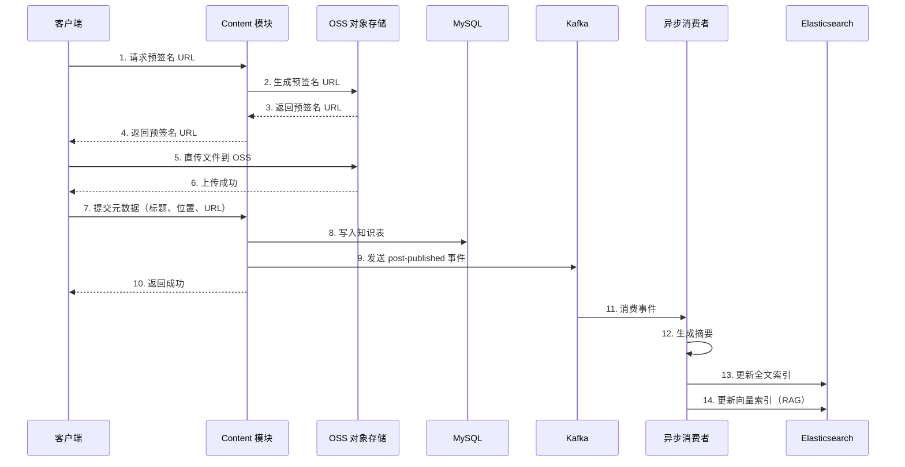
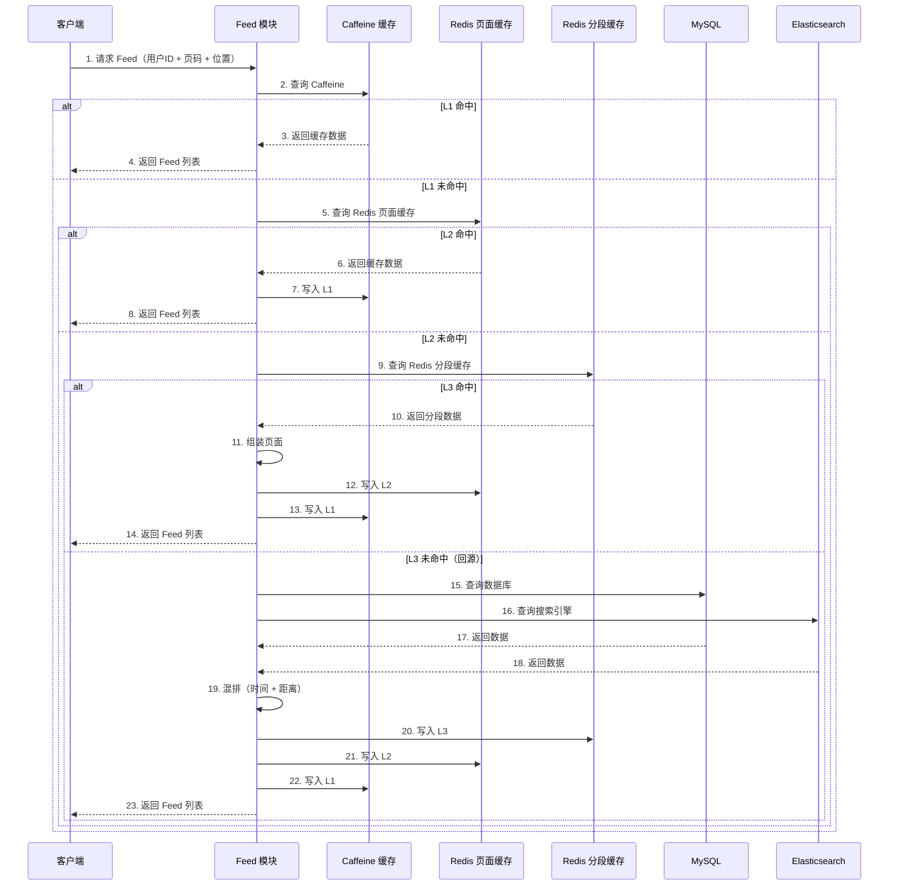
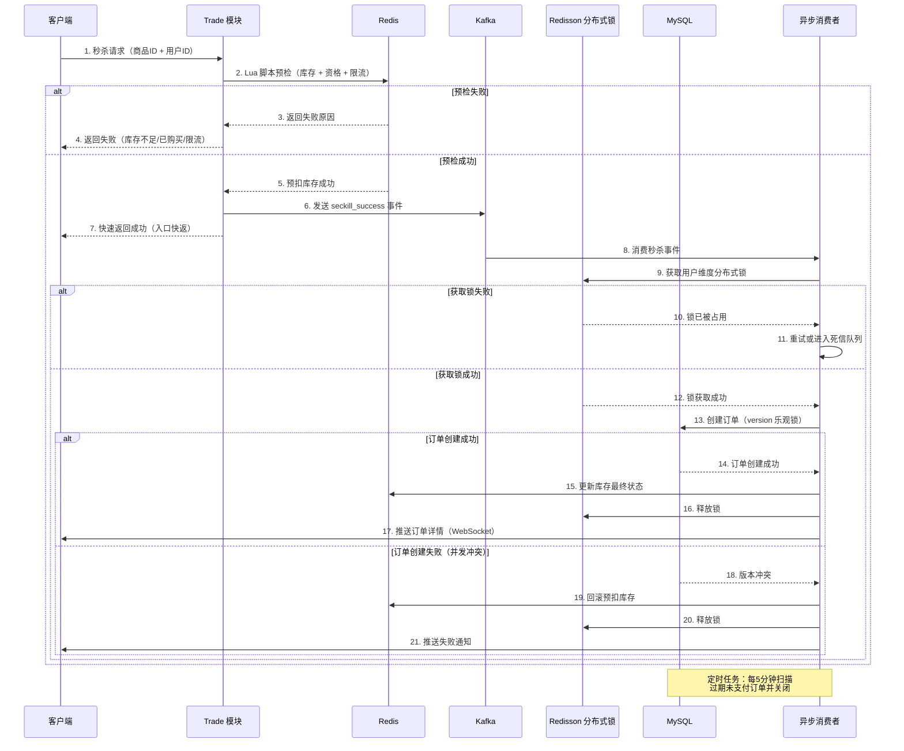

# 邻里知光 - 基于 LBS 的智能社区生活服务平台

> 打通"本地知识发布 → 本地发现 → AI 问答 → 社交裂变 → 交易转化"的完整闭环

## 项目简介

邻里知光是一个基于地理位置的智能社区知识生活服务平台，解决传统 O2O 在高并发下的性能瓶颈、周边检索效率低、本地知识服务缺失等问题。

### 核心特性

- **高并发架构**：点赞/关注/秒杀链路抗压，Feed 首页低延迟高命中
- **智能 LBS**：GeoRadius + GeoHash 双模式地理检索，米级精度
- **本地化 RAG**：基于向量检索的本地知识问答，支持流式输出
- **分布式一致性**：Outbox + Canal + Kafka + 乐观锁组合保障
- **企业级安全**：JWT 双令牌 + Redis 白名单 + 登录失败追踪 + 审计日志

## 技术栈

### 后端技术
- **框架**：Spring Boot 3.x + Spring Security
- **数据库**：MySQL 8.0 + Redis 7.0
- **搜索引擎**：Elasticsearch（向量检索 + 全文搜索）
- **消息队列**：Kafka（异步事件处理）
- **数据同步**：Canal（MySQL binlog 订阅）
- **AI 能力**：DeepSeek + Spring AI（RAG 问答）
- **对象存储**：OSS（预签名直传）

### 核心中间件
- **认证**：JWT RS256 非对称加密
- **缓存**：Caffeine（本地缓存）+ Redis（分布式缓存）
- **限流**：Redis 滑动窗口
- **防护**：Single-flight + 热点保护 + 降级开关

## 架构设计

### 分层架构

项目采用“领域模块化单体 + 统一分层”的架构模式，模块分为两大类：

- **核心业务模块**：面向用户直接感知的业务场景，如认证、发现、内容、个人主页、Feed、社交、交易、AI 问答
- **基础支持模块**：为业务模块提供通用能力，如线程池、防护、一致性、数据访问规范、平台治理

每个模块遵循统一的目录规范：

```
模块名/
├── controller/    # HTTP 接口层
├── service/       # 业务编排层
├── mapper/        # 数据访问层
├── model/         # DTO/Entity/VO
└── event/         # 事件定义与消费（可选）
```

### 调用约束

1. 模块内调用顺序：`controller → service → mapper`
2. 禁止 `controller` 直接调用 `mapper`
3. 跨模块调用只允许调用对方 `service` 或通过事件总线
4. 公共工具统一放 `common`，不得放业务逻辑

## 核心模块

### 核心业务模块

#### 模块进度总览

| 模块 | 状态 | 说明 |
| --- | --- | --- |
| auth | ✅ 已完成 | 注册、登录、JWT 双令牌、黑名单、验证码、`/me` 已打通 |
| discover | ✅ 已实现（基础版） | LBS 发现主链已落地，后续继续做体验和稳定性收口 |
| content | ✅ 已完成 | 草稿、预签名上传、发布、详情、列表、删除已打通 |
| social | ✅ 已完成 | 关注、点赞、收藏、计数、Kafka 聚合与回放入口已打通 |
| feed | ✅ 已完成 | Feed 首页、匿名浏览、缓存、与 content/social 联动已打通 |
| profile | ✅ 已实现（基础版） | 已支持资料查询、资料编辑、头像单独更新、个人主页信息聚合、个人发布列表、关注/粉丝资料列表 |
| rag | ✅ 已实现（基础版） | 已支持基础版流式问答与单篇索引重建入口 |
| trade | ✅ 已实现（基础版） | 已支持活动创建/查询、Redis+Lua 预扣、异步下单、支付、主动取消、主动/被动关单、补偿回写 |

### 1. auth - 认证模块 ✅
**状态**：已完成

**功能**：
- JWT 双令牌认证（Access Token 15分钟 + Refresh Token 7天）
- 登录失败追踪（3次验证码，10次封禁）
- 黑名单机制
- 密码重置（短信验证码验证）
- 审计日志记录

**技术亮点**：
- RSA 2048位非对称加密
- Refresh Token 轮换防泄露
- Redis 白名单 + Lua 脚本原子消费
- 统一错误消息防用户枚举

### 2. discover - 发现模块 ✅
**状态**：已实现（基础版）

**功能**：基于 LBS 的附近内容发现

**核心能力**：
- GeoRadius + GeoHash 双模式地理检索
- 支持知识、商家、活动的附近搜索
- 米级精度距离计算
- 热点区域缓存优化

**技术实现**：
- Redis Geo 数据结构存储地理位置
- GeoHash 编码实现快速范围查询
- ES 地理位置索引支持复杂过滤
- 缓存热点区域查询结果（TTL 2分钟）

**数据模型**：
```
Redis Key: geo:knowledge, geo:merchant
ES Index: knowledge_geo, merchant_geo
```

### 3. content - 内容模块 ✅
**状态**：已完成

**功能**：知识内容发布与管理

**核心能力**：
- OSS 预签名直传（避免服务端流量）
- 元数据结构化存储
- 草稿、正文确认、发布、置顶、可见性、删除等内容管理动作
- 异步摘要生成
- 内容审核预留接口

**技术实现**：
- 客户端通过预签名 URL 直传 OSS
- 服务端负责草稿、正文确认、元数据更新和发布状态流转
- 发布时同步维护 Discover 索引，并保留 Outbox 事件作为后续扩展入口
- MySQL 存储结构化数据，ES 存储全文索引

**发布流程**：
1. 客户端请求预签名 URL
2. 客户端直传文件到 OSS
3. 客户端确认正文上传并提交元数据
4. 服务端发布内容并写入 MySQL，同时同步更新 Discover
5. Outbox 事件预留给后续摘要生成与索引更新链路

### 4. rag - RAG 问答模块
**状态**：已实现（基础版）

**功能**：本地化智能问答

**核心能力**：
- 向量检索 + LLM 生成
- SSE 流式输出
- LBS 上下文增强
- 问答日志记录

**技术实现**：
- ES 向量索引存储知识分块
- 分块策略：Markdown 标题 + 段落（512 token）
- DeepSeek API 通过 Spring AI 封装
- 召回 Top-K（8-12）片段注入 Prompt
- LBS 过滤：优先召回附近知识

**问答流程**：
1. 用户提问 + 地理位置
2. 向量检索召回相关片段（带 LBS 过滤）
3. 构建 Prompt（系统指令 + 上下文 + 问题）
4. LLM 生成答案（SSE 流式返回）
5. 记录问答日志（问题、召回、答案、耗时）

**当前基础版口径**：
- 已先落地独立 `rag` 模块与 SSE 流式输出接口
- 已支持单篇帖子索引重建入口，便于后续接真正的切片与向量索引
- 当前回答基于内容摘要与简化召回生成，后续再接入真实 ES 向量检索与大模型

### 5. social - 社交模块 ✅
**状态**：已完成

**功能**：高并发社交互动

**核心能力**：
- 点赞/收藏（Redis 位图 + Kafka 异步）
- 计数系统（自定义 SDS 计数统计）
- 关注/取关（Outbox + Canal 同步）
- 评论系统

**技术实现**：
- **点赞/收藏**：
  - Kafka 异步化，消费者用 Lua 原子更新位图和计数
  - Redis 位图 key：`like:bit:{target_id}`
  - 计数 key：`count:like:{target_id}`
- **关注/取关**：
  - 同事务写 `follow` + `outbox`
  - Canal 订阅 binlog 推送 `follow_event`
  - 消费者更新粉丝计数与 zset 列表

**一致性保障**：
- Outbox 模式确保业务事务和消息投递同源
- Canal 自动捕获数据变更，无需业务代码侵入
- 死信队列处理失败消息

### 6. feed - Feed 流模块 ✅
**状态**：已完成

**功能**：智能内容推荐

**核心能力**：
- 三级缓存（Caffeine + Redis 页面 + Redis 分段）
- Single-flight 防击穿
- 热点自动延长 TTL
- 按时间/距离混排

**技术实现**：
- **L1 Caffeine**（5s）：本地缓存，极速响应
- **L2 Redis 页面**（30s）：完整页面缓存
- **L3 Redis 分段**（2min）：按 GeoHash 分段缓存
- **Single-flight**：同一查询只回源一次
- **热点保护**：自动延长热点 key 的 TTL + 抖动

**缓存 Key 规范**：
```
feed:page:{user_id}:{page}
feed:segment:{geo_hash}:{timestamp}
```

### 补充模块：profile - 个人模块 ✅
**状态**：已实现（基础版）

**功能**：承接个人主页、资料编辑与用户侧聚合展示

**已实现能力**：
- 个人资料查看与编辑（昵称、头像、简介、学校、标签等）
- 头像单独更新接口，便于前端后续接上传链路
- 个人主页聚合（基础信息 + 社交计数 + 关系状态）
- 我的发布列表与分页聚合
- 关注列表、粉丝列表的资料视图聚合
- 对外用户主页展示，作为 content / social / feed 的统一用户出口

**与现有模块的关系**：
- 复用 `auth` 的当前登录用户能力与 `/me` 基础信息
- 聚合 `social` 的粉丝数、关注数、获赞数、关系状态
- 聚合 `content` 的个人发布内容列表
- 作为后续“我的”、“TA 的主页”、“作者卡片详情页”的统一承接模块

### 7. trade - 交易模块 ✅
**状态**：已实现（基础版）

**功能**：秒杀与团购

**核心能力**：
- 库存扣减（Redis + Lua 原子操作）
- 防超卖机制
- 订单一致性保障
- 未支付自动关单

**技术实现**：
- **活动热点缓存**：空值缓存 + 互斥锁 + 随机 TTL，防穿透、击穿、雪崩
- **秒杀预检**：Lua 原子校验库存、限购并完成 Redis 预扣
- **异步下单**：Kafka 开关可切换，关闭时回退本地线程池执行
- **一致性保障**：提交锁 + MySQL 乐观锁 + outbox 补偿回写 Redis
- **关单收口**：每分钟主动扫描过期未支付订单，查单时再做一次被动关单
- **状态回查**：异步下单后支持按订单号查询受理状态
- **接口防护**：Redis 滑动窗口限流切面拦截高频下单

**秒杀流程**：
1. 入口快返：Redis 预扣成功即返回受理结果
2. 下单防重：用户维度分布式锁
3. 异步落单：Kafka / 本地线程池消费下单事件
4. 订单表 `version` 乐观锁字段
5. 主动/被动关单：回补数据库库存，并补偿同步 Redis

### 基础支持模块

### 8. threadpool - 线程池模块 ✅
**状态**：已实现（基础版）

**功能**：异步任务编排

**核心能力**：
- 动态线程池配置（LADBTP）
- 任务监控与告警
- 轻/中/重负载三态入队策略

**技术实现**：
- Buffer Factor 决定扩容强度
- 重载可强制入队 + 降级
- 配置中心动态调整参数
- 指标暴露（队列长度、执行时间、拒绝次数）

### 9. guard - 防护模块 ✅
**状态**：已实现（基础版）

**功能**：系统防护

**核心能力**：
- 限流（全局/IP/用户维度）
- 防穿透、防雪崩
- 降级开关
- 熔断机制

**技术实现**：
- AOP + 注解 + Redis 滑动窗口限流
- 布隆过滤器防缓存穿透
- Single-flight 防缓存击穿
- 热点 key 自动延长 TTL 防雪崩
- 配置中心控制降级开关

### 10. data - 数据层模块
**功能**：数据访问规范

**核心能力**：
- 统一数据访问接口
- 乐观锁版本控制
- 分库分表预留

**技术实现**：
- Mapper 层统一接口规范
- 所有表包含 `version` 字段
- 更新操作使用 `WHERE version = ?` 条件
- 租户 key 前缀预留多租户支持

### 11. consistency - 一致性模块
**功能**：分布式一致性保障

**核心能力**：
- Outbox 模式
- 死信队列
- 自愈机制
- 事件回放

**技术实现**：
- 业务事务同时写入 `outbox` 表
- Canal 订阅 binlog 推送到 Kafka
- 消费失败进入死信队列
- 定时任务扫描 outbox 补偿未投递消息
- 位图重建工具修复数据不一致

### 12. platform - 平台化模块
**功能**：平台治理

**核心能力**：
- 多租户支持
- 可观测性
- 商业化预留
- 服务拆分预案

**技术实现**：
- Prometheus + Grafana + SkyWalking 监控
- 关键链路指标可视化（QPS、RT、错误率）
- 事件驱动保持松耦合，支持服务拆分
- 知识付费权限模型预留
- 社区电商扩展模型预留

## 业务流程梳理

### 整体架构流程



### 认证模块流程

```mermaid
flowchart TD
    Start([认证模块入口])

    Start --> Choice{选择操作}

    Choice -->|1| SendCode[发送验证码]
    Choice -->|2| Register[用户注册]
    Choice -->|3| PwdLogin[密码登录]
    Choice -->|4| SmsLogin[验证码登录]
    Choice -->|5| Refresh[刷新令牌]
    Choice -->|6| Logout[用户登出]
    Choice -->|7| ResetPwd[重置密码]

    %% 流程1: 发送验证码
    SendCode --> SC1{检查发送间隔<br/>60秒}
    SC1 -->|未满60秒| SC_Fail1[返回429: 请等待]
    SC1 -->|已满60秒| SC2{检查每日上限<br/>10次}
    SC2 -->|已达上限| SC_Fail2[返回429: 今日已达上限]
    SC2 -->|未达上限| SC3[生成6位验证码]
    SC3 --> SC4[Redis HSET<br/>auth:code:scene:phone<br/>code/maxAttempts:5/attempts:0]
    SC4 --> SC5[设置过期时间 5分钟]
    SC5 --> SC6[Redis SET interval key<br/>过期60秒]
    SC6 --> SC7[Redis INCR daily key]
    SC7 --> SC_Success[返回200: 验证码已发送]

    %% 流程2: 用户注册
    Register --> R1[验证码校验<br/>Lua脚本原子操作]
    R1 --> R2{验证码是否有效}
    R2 -->|无效/过期/超限| R_Fail1[审计日志<br/>返回401: 验证码错误]
    R2 -->|有效| R3[生成雪花ID]
    R3 --> R4[BCrypt加密密码]
    R4 --> R5[MySQL saveIfPhoneAbsent]
    R5 --> R6{手机号是否存在}
    R6 -->|已存在| R_Fail2[审计日志<br/>返回409: 手机号已注册]
    R6 -->|不存在| R7[签发JWT双令牌<br/>Access 15min + Refresh 7days]
    R7 --> R8[解析Refresh Token<br/>获取jti和expiresAt]
    R8 --> R9[Redis SADD<br/>auth:refresh:userId jti]
    R9 --> R10[审计日志: 注册成功]
    R10 --> R_Success[返回200: userId + tokens]

    %% 流程3: 密码登录
    PwdLogin --> PL1{检查失败次数<br/>是否>=10次}
    PL1 -->|是| PL_Fail1[审计日志<br/>返回403: 账号锁定30分钟]
    PL1 -->|否| PL2{失败次数>=3次}
    PL2 -->|是| PL3{是否提供<br/>图形验证码}
    PL3 -->|否| PL_Fail2[审计日志<br/>返回400: 需要验证码]
    PL3 -->|是| PL4{验证码是否正确}
    PL4 -->|否| PL5[记录失败次数]
    PL5 --> PL_Fail3[审计日志<br/>返回400: 验证码错误]
    PL2 -->|否| PL6[查询用户<br/>findByPhoneOrUsername]
    PL4 -->|是| PL6
    PL6 --> PL7{用户是否存在}
    PL7 -->|否| PL8[执行dummy hash<br/>防止时序攻击]
    PL8 --> PL9[记录失败次数]
    PL9 --> PL_Fail4[审计日志<br/>返回401: 用户不存在]
    PL7 -->|是| PL10{检查黑名单<br/>Redis SISMEMBER}
    PL10 -->|在黑名单| PL_Fail5[审计日志<br/>返回403: 账号已封禁]
    PL10 -->|不在| PL11{验证密码<br/>BCrypt matches}
    PL11 -->|错误| PL12[记录失败次数]
    PL12 --> PL_Fail6[审计日志<br/>返回401: 密码错误]
    PL11 -->|正确| PL13[重置失败计数]
    PL13 --> PL14[签发JWT双令牌]
    PL14 --> PL15[Redis SADD保存jti]
    PL15 --> PL16[审计日志: 登录成功]
    PL16 --> PL_Success[返回200: userId + tokens]

    %% 流程4: 验证码登录
    SmsLogin --> SL1[验证码校验<br/>Lua脚本原子操作]
    SL1 --> SL2{验证码是否有效}
    SL2 -->|无效| SL_Fail1[审计日志<br/>返回401: 验证码错误]
    SL2 -->|有效| SL3[查询用户 findByPhone]
    SL3 --> SL4{用户是否存在}
    SL4 -->|否| SL_Fail2[返回401: 用户未注册]
    SL4 -->|是| SL5{检查黑名单}
    SL5 -->|在黑名单| SL_Fail3[审计日志<br/>返回403: 账号已封禁]
    SL5 -->|不在| SL6[签发JWT双令牌]
    SL6 --> SL7[Redis SADD保存jti]
    SL7 --> SL8[审计日志: 登录成功]
    SL8 --> SL_Success[返回200: userId + tokens]

    %% 流程5: 刷新令牌
    Refresh --> RF1[JWT验证Refresh Token]
    RF1 --> RF2{令牌是否有效}
    RF2 -->|无效/过期| RF_Fail1[返回401: 令牌无效]
    RF2 -->|有效| RF3[解析userId/jti/expiresAt]
    RF3 --> RF4[查询用户 findByUserId]
    RF4 --> RF5{用户是否存在}
    RF5 -->|否| RF_Fail2[返回401: 用户不存在]
    RF5 -->|是| RF6{检查黑名单}
    RF6 -->|在黑名单| RF7[清空所有refresh token<br/>Redis DEL]
    RF7 --> RF_Fail3[返回403: 账号已封禁]
    RF6 -->|不在| RF8[消费刷新令牌<br/>Redis SREM jti]
    RF8 --> RF9{jti是否在白名单}
    RF9 -->|否| RF_Fail4[返回401: 令牌已失效]
    RF9 -->|是| RF10[签发新JWT双令牌]
    RF10 --> RF11[Redis SADD保存新jti]
    RF11 --> RF_Success[返回200: 新tokens]

    %% 流程6: 用户登出
    Logout --> LO1[JWT验证Refresh Token]
    LO1 --> LO2[解析userId和jti]
    LO2 --> LO3{登出范围}
    LO3 -->|all_devices| LO4[Redis DEL<br/>auth:refresh:userId]
    LO4 --> LO_Success1[返回200: 已登出所有设备]
    LO3 -->|current_device| LO5[Redis SREM<br/>移除当前jti]
    LO5 --> LO_Success2[返回200: 已登出当前设备]

    %% 流程7: 重置密码
    ResetPwd --> RP1[验证码校验<br/>Lua脚本原子操作]
    RP1 --> RP2{验证码是否有效}
    RP2 -->|无效| RP_Fail1[审计日志<br/>返回401: 验证码错误]
    RP2 -->|有效| RP3[查询用户 findByPhone]
    RP3 --> RP4{用户是否存在}
    RP4 -->|否| RP_Fail2[返回400: 手机号未注册]
    RP4 -->|是| RP5[BCrypt加密新密码]
    RP5 --> RP6[MySQL更新密码]
    RP6 --> RP7[清空所有refresh token<br/>Redis DEL]
    RP7 --> RP8[审计日志: 密码重置成功]
    RP8 --> RP_Success[返回200: 密码重置成功]

    %% 结束节点
    SC_Fail1 --> End([流程结束])
    SC_Fail2 --> End
    SC_Success --> End
    R_Fail1 --> End
    R_Fail2 --> End
    R_Success --> End
    PL_Fail1 --> End
    PL_Fail2 --> End
    PL_Fail3 --> End
    PL_Fail4 --> End
    PL_Fail5 --> End
    PL_Fail6 --> End
    PL_Success --> End
    SL_Fail1 --> End
    SL_Fail2 --> End
    SL_Fail3 --> End
    SL_Success --> End
    RF_Fail1 --> End
    RF_Fail2 --> End
    RF_Fail3 --> End
    RF_Fail4 --> End
    RF_Success --> End
    LO_Success1 --> End
    LO_Success2 --> End
    RP_Fail1 --> End
    RP_Fail2 --> End
    RP_Success --> End

    %% 样式定义
    classDef successStyle fill:#d4edda,stroke:#28a745,stroke-width:2px
    classDef failStyle fill:#f8d7da,stroke:#dc3545,stroke-width:2px
    classDef processStyle fill:#d1ecf1,stroke:#17a2b8,stroke-width:2px
    classDef decisionStyle fill:#fff3cd,stroke:#ffc107,stroke-width:2px

    class SC_Success,R_Success,PL_Success,SL_Success,RF_Success,LO_Success1,LO_Success2,RP_Success successStyle
    class SC_Fail1,SC_Fail2,R_Fail1,R_Fail2,PL_Fail1,PL_Fail2,PL_Fail3,PL_Fail4,PL_Fail5,PL_Fail6,SL_Fail1,SL_Fail2,SL_Fail3,RF_Fail1,RF_Fail2,RF_Fail3,RF_Fail4,RP_Fail1,RP_Fail2 failStyle
    class SendCode,Register,PwdLogin,SmsLogin,Refresh,Logout,ResetPwd,SC3,SC4,SC5,SC6,SC7,R3,R4,R5,R7,R8,R9,R10,PL6,PL8,PL9,PL13,PL14,PL15,PL16,SL1,SL3,SL6,SL7,SL8,RF1,RF3,RF4,RF8,RF10,RF11,LO1,LO2,LO4,LO5,RP3,RP5,RP6,RP7,RP8 processStyle
    class Choice,SC1,SC2,R2,R6,PL1,PL2,PL3,PL4,PL7,PL10,PL11,SL2,SL4,SL5,RF2,RF5,RF6,RF9,LO3,RP2,RP4 decisionStyle
```



### 知识发布流程



### Feed 浏览流程



### 秒杀交易流程



## 快速开始

### 环境要求
- JDK 17+
- Maven 3.8+
- MySQL 8.0+
- Redis 7.0+
- Elasticsearch 8.x（可选，RAG 模块需要）
- Kafka 3.x（可选，异步事件需要）

### 配置说明

1. **生成 RSA 密钥对**（生产环境必需）
```bash
# 生成私钥
openssl genrsa -out private.pem 2048

# 生成公钥
openssl rsa -in private.pem -pubout -out public.pem
```

2. **配置环境变量**
```bash
# JWT 密钥
export JWT_PUBLIC_KEY="$(cat public.pem | sed 's/$/\\n/' | tr -d '\n')"
export JWT_PRIVATE_KEY="$(cat private.pem | sed 's/$/\\n/' | tr -d '\n')"

# Redis
export REDIS_HOST=localhost
export REDIS_PORT=6379
export REDIS_PASSWORD=your_password
```

3. **修改配置文件**
```yaml
# src/main/resources/application.yml
spring:
  data:
    redis:
      host: ${REDIS_HOST:localhost}
      port: ${REDIS_PORT:6379}
      password: ${REDIS_PASSWORD:}

security:
  jwt:
    public-key: ${JWT_PUBLIC_KEY}
    private-key: ${JWT_PRIVATE_KEY}
    allow-ephemeral-keys: false  # 生产环境必须为 false
```

### 运行项目

1. **启动依赖服务**
```bash
# 启动 Redis
docker run -d -p 6379:6379 redis:7.0

# 启动 MySQL
docker run -d -p 3306:3306 -e MYSQL_ROOT_PASSWORD=root mysql:8.0
```

2. **编译运行**
```bash
# 编译
mvn clean package -DskipTests

# 运行
java -jar target/zhiguang-be-0.0.1-SNAPSHOT.jar
```

3. **验证服务**
```bash
# 健康检查
curl http://localhost:8080/actuator/health

# 注册用户
curl -X POST http://localhost:8080/api/v1/auth/register \
  -H "Content-Type: application/json" \
  -d '{
    "phone": "13800138000",
    "password": "Test1234",
    "nickname": "测试用户",
    "smsCode": "123456"
  }'
```

## API 文档

### 认证接口

| 接口 | 方法 | 路径 | 说明 |
|------|------|------|------|
| 用户注册 | POST | `/api/v1/auth/register` | 创建新用户并返回令牌 |
| 用户登录 | POST | `/api/v1/auth/login` | 验证凭证并返回令牌 |
| 刷新令牌 | POST | `/api/v1/auth/token/refresh` | 使用 Refresh Token 获取新令牌 |
| 用户登出 | POST | `/api/v1/auth/logout` | 撤销令牌（支持单设备/全设备） |
| 密码重置 | POST | `/api/v1/auth/password/reset` | 通过短信验证码重置密码 |

详细 API 文档请参考：
- [后端API-超详细.md](后端API-超详细.md)
- [前端API-标准版.md](前端API-标准版.md)

## 开发规范

### 代码规范
1. 遵循 12 模块分层架构约束
2. 模块内调用顺序：`controller → service → mapper`
3. 跨模块调用只允许调用对方 `service` 或通过事件总线
4. 禁止 `controller` 直接调用 `mapper`

### 命名规范
- Controller：`XxxController`
- Service：`XxxService` + `XxxServiceImpl`
- Mapper：`XxxMapper`
- Model：`XxxRequest`、`XxxResponse`、`XxxEntity`

### 安全规范
- 生产环境必须配置持久化 RSA 密钥
- 禁用临时密钥（`allow-ephemeral-keys: false`）
- 敏感操作必须记录审计日志
- 所有接口必须进行输入验证

## 技术文档

- [邻里知光-技术分档-详细版.md](邻里知光-技术分档-详细版.md) - 完整技术架构设计
- [ARCHITECTURE-12-MODULES.md](ARCHITECTURE-12-MODULES.md) - 12 模块分层架构约束
- [认证模块-开发实现清单.md](认证模块-开发实现清单.md) - 认证模块实现细节
- [后端API-超详细.md](后端API-超详细.md) - 后端 API 完整文档
- [前端API-标准版.md](前端API-标准版.md) - 前端 API 标准文档

## 开发进度

### T1 核心闭环档 ✅
- [x] 认证系统（JWT 双令牌 + 登录失败追踪 + 审计日志）
- [ ] LBS 发现（GeoRadius + GeoHash）
- [ ] 知识发布（OSS 直传）
- [ ] Feed 基础版

### T2 高并发稳定档
- [ ] 社交高并发写（点赞/关注异步化）
- [ ] 智能 Feed 全量版（三级缓存）
- [ ] 防护中心（限流/防穿透/防雪崩）

### T3 智能增强档
- [ ] 本地知识 RAG
- [ ] 向量检索
- [ ] 流式问答

### T4 交易攻坚档
- [ ] 秒杀防超卖
- [ ] 订单一致性

### T5 平台化演进档
- [ ] 多租户支持
- [ ] 可观测性
- [ ] 商业化预留

## 性能指标

### 认证模块
- 登录接口 P95 < 100ms（缓存命中）
- JWT 验证 P95 < 10ms
- Refresh Token 轮换 P95 < 50ms

### 目标性能（T2 完成后）
- Feed 首页 P95 < 150ms
- 附近检索 P95 < 150ms
- 点赞/关注 P95 < 50ms
- 缓存命中率 > 95%

## 贡献指南

欢迎贡献代码！请遵循以下步骤：

1. Fork 本仓库
2. 创建特性分支 (`git checkout -b feature/AmazingFeature`)
3. 提交更改 (`git commit -m 'Add some AmazingFeature'`)
4. 推送到分支 (`git push origin feature/AmazingFeature`)
5. 开启 Pull Request

## 许可证

本项目仅供学习和研究使用。

## 联系方式

如有问题或建议，欢迎提交 Issue。

---

**邻里知光** - 让本地知识触手可及

## 当前阶段口径

- 一期先保证匿名浏览链路自然跑通，真正需要匿名放行的是发现、内容详情、搜索、Feed 首页和互动汇总这类只读接口。
- 二期再单独收拾 `follow / like / favorite`，重点处理幂等、计数折叠和 Kafka 演进路径，不和一期浏览态混做。
- 交互型接口继续要求登录态，避免“首页只想看帖子”也被 JWT 强绑。
- 当前主线已完成 `auth / discover（基础版） / content / social / feed / profile（基础版） / rag（基础版） / trade（基础版）`，后续继续围绕 discover 稳定性、RAG 检索增强和 trade 二期能力展开。
