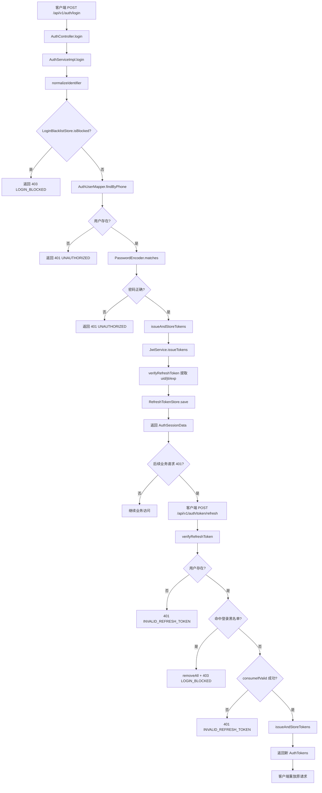

# 登录流程梳理（后端实现对齐）

## 1. 入口与核心参与者
- 入口接口：`POST /api/v1/auth/login`（`AuthController#login`）。
- 核心服务：`AuthServiceImpl#login`。
- 关键依赖：
  - `LoginBlacklistStore`：登录黑名单拦截；
  - `AuthUserMapper`：按手机号查询账号；
  - `PasswordEncoder`：密码比对；
  - `JwtService`：签发 access/refresh token；
  - `RefreshTokenStore`：写入 refresh token 白名单。

## 2. 后端登录主流程
1. Controller 接收并校验 `LoginRequest(identifier, password, channel, accessToken)`。
2. Service 规范化登录标识（`trim`）。
3. 黑名单校验：若标识被封禁，直接返回 `403 LOGIN_BLOCKED`。
4. 同手机号登录请求需满足最小间隔 20s；过于频繁返回 `429 RATE_LIMITED`。
5. 按手机号查找账号：未命中计入失败次数。
6. 密码校验：不匹配计入失败次数。
7. 同手机号失败累计达到 5 次后加入黑名单并返回 `403 LOGIN_BLOCKED`。
8. 登录成功后清理失败计数并执行 `issueAndStoreTokens(userId)`：
   - `JwtService.issueTokens` 签发 access + refresh；
   - 解析 refresh token 得到 `uid/jti/exp`；
   - `RefreshTokenStore.save(uid, jti, exp)` 写入白名单。
9. 返回 `AuthSessionData(userId, tokens)` 给前端。

## 3. 关联会话续期流程（401 后刷新）
前端约定：业务接口收到 401 时调用 `POST /auth/token/refresh`。服务端逻辑：
1. `verifyRefreshToken` 验签并确认 refresh token。
2. 查用户是否存在；不存在返回 `401 INVALID_REFRESH_TOKEN`。
3. 若手机号命中黑名单：`removeAll(userId)` 吊销全部 refresh，再返回 `403 LOGIN_BLOCKED`。
4. `consumeIfValid(userId, jti)` 原子消费旧 refresh（防重放）；失败返回 `401 INVALID_REFRESH_TOKEN`。
5. 重新签发并保存新 token 对（完成 refresh 轮换）。

## 4. Mermaid 流程图（登录 + 刷新）

## 5. 关键特性总结
- 黑名单是登录前置拦截点，且也会在 refresh 时生效。
- refresh token 采用“白名单 + 一次性消费”模型，降低重放风险。
- 密码重置会 `removeAll(userId)`，强制历史会话失效。
