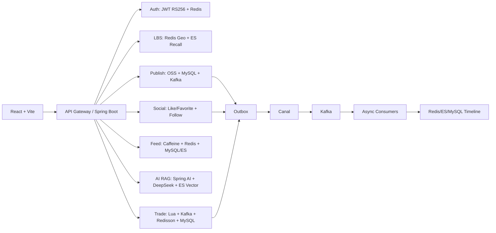

# 邻里知光 技术分档（详细版）

> 文档来源：`C:\Users\zhangxt\Desktop\new project.docx`（已读取并结构化整理）
> 项目全称：邻里知光 - 基于 LBS 的智能社区知识生活服务平台

## 1. 项目目标与边界

### 1.1 业务目标
- 解决传统 O2O 在高并发下崩溃、周边检索效率低、本地知识服务缺失的问题。
- 打通“本地知识发布 -> 本地发现 -> AI 问答 -> 社交裂变 -> 交易转化”的完整闭环。
- 具备可直接上线和可持续演进能力，支持后续知识付费与社区电商。

### 1.2 技术目标
- 高并发写：点赞/关注/秒杀链路抗压并保证一致性。
- 高并发读：Feed 首页低延迟、高命中、抗雪崩。
- 分布式一致性：Outbox + Canal + Kafka + 乐观锁组合保障。
- AI 可用性：RAG 首问低时延、可定位到本地上下文。

## 2. 技术分档总览

| 档位 | 档位名称 | 核心目标 | 覆盖模块（对应原文） | 预期产出 |
| --- | --- | --- | --- | --- |
| T1 | 核心闭环档 | 完成可用业务主链路 | 模块1/2/3/6(基础) | 可用 MVP，具备认证、发布、附近发现、基础 Feed |
| T2 | 高并发稳定档 | 解决高并发写读稳定性 | 模块5/6/9/10 | 抗峰值能力提升，缓存与限流体系成型 |
| T3 | 智能增强档 | 构建本地化 AI 问答能力 | 模块4/10/11 | 形成可解释 RAG 闭环，支持流式问答 |
| T4 | 交易攻坚档 | 秒杀/团购防超卖与低 RT | 模块7/8/11 | 交易链路具备高并发可用性和一致性保障 |
| T5 | 平台化演进档 | 架构可扩展与商业化预留 | 模块12 + 全链路治理 | 支持多租户、可观测、付费化与服务拆分 |

## 3. 分档详细设计

## 3.1 T1 核心闭环档（先跑通）

### 3.1.1 建设范围
- 认证系统：JWT RS256 双令牌（Access + Refresh）+ Redis 白名单。
- LBS 发现：GeoRadius + GeoHash 双模式附近检索。
- 知识发布：OSS 预签名直传 + 元数据落库 + 异步摘要入口。
- Feed 基础版：按时间/距离混排，提供分页查询能力。

### 3.1.2 核心技术要点
- 鉴权：Access Token 15 分钟，Refresh Token 7 天；Refresh 轮换时旧 token 入黑名单。
- 地理检索：Redis `geo:knowledge`、`geo:merchant`；返回米级距离。
- 上传链路：客户端直传 OSS，服务端只存结构化元数据。
- 基础读优化：Feed 页缓存先走 Redis，命中失败回源 MySQL + ES。

### 3.1.3 交付验收
- 用户可完成注册登录、发帖、附近发现、查看首页流。
- 热点区域附近检索 P95 < 150ms（缓存命中场景）。
- 上传链路稳定，后端不承接大文件流量。

### 3.1.4 风险与控制
- 风险：Refresh Token 泄漏导致长期风险。
- 控制：设备维度 token、异常登录即刻吊销、IP/用户滑动窗口限流。

## 3.2 T2 高并发稳定档（抗压核心）

### 3.2.1 建设范围
- 社交高并发写：点赞/收藏位图化，关注关系 Outbox 化。
- 智能 Feed 全量版：三级缓存 + single-flight + 热点保护。
- 防护中心：限流、防穿透、防雪崩、降级开关。
- 数据层规范：表结构 version 字段、Redis key 规范化。

### 3.2.2 核心技术要点
- 点赞/收藏：
  - Kafka `like_event` 异步化，消费者用 Lua 原子更新位图和计数。
  - Redis 位图 key：`like:bit:{target_id}`，计数 key：`count:like:{target_id}`。
- 关注/取关：
  - 同事务写 `follow` + `outbox`。
  - Canal 订阅 binlog 推送 `follow_event`，消费者更新粉丝计数与 zset 列表。
- Feed 读链路：
  - L1 Caffeine（5s）-> L2 Redis 页面（30s）-> L3 Redis 分段（2min）。
  - hotkey 自动延长 TTL + 抖动；single-flight 避免回源放大。
- 限流：
  - AOP + 注解 + Redis 滑动窗口。
  - 维度：全局/IP/用户。

### 3.2.3 交付验收
- 点赞/关注在压测下稳定可用，无明显写放大。
- Feed 首页缓存命中率 > 95%，回源峰值可控。
- 限流触发后接口行为可观测，日志完整。

### 3.2.4 风险与控制
- 风险：异步链路延迟造成“短暂不一致”。
- 控制：死信队列、重放工具、定时自愈（位图重建）。

## 3.3 T3 智能增强档（RAG 差异化）

### 3.3.1 建设范围
- 本地知识 RAG：召回 + 生成 + SSE 流式返回。
- 索引治理：分块、版本幂等、重建策略。
- 问答日志：问题、召回片段、答案、耗时全链路记录。

### 3.3.2 核心技术要点
- 向量检索：ES 向量索引 Top-K（默认 8-12），支持 LBS 过滤。
- 分块策略：Markdown 标题 + 段落 + 固定 token 分片（建议 512）。
- Prompt：系统指令 + 召回上下文 + 用户问题 + LBS 上下文。
- 生成输出：DeepSeek 经 Spring AI 封装，SSE 持续回流前端。

### 3.3.3 交付验收
- 首问时延显著下降（预索引后目标 < 800ms）。
- 本地问题可优先召回附近知识，提高命中与可解释性。
- 更新知识后向量索引可幂等刷新，无陈旧答案污染。

### 3.3.4 风险与控制
- 风险：召回漂移导致答案不稳定。
- 控制：版本标记、分片去重、召回质量离线评估。

## 3.4 T4 交易攻坚档（秒杀/团购）

### 3.4.1 建设范围
- 秒杀预检：Lua 原子校验库存、资格、限流并完成预扣。
- 异步下单：Kafka 解耦 + LADBTP 执行。
- 一致性保障：Redisson 分布式锁 + MySQL 乐观锁。
- 订单治理：未支付自动关单，冲突场景幂等处理。

### 3.4.2 核心技术要点
- 入口快返：预检成功即发 `seckill_success` 事件。
- 下单防重：用户维度分布式锁，订单表 `version` 乐观锁字段。
- 数据回写：库存最终状态同步 Redis 与 ES 索引。
- 定时兜底：每 5 分钟扫描过期未支付订单并关闭。

### 3.4.3 交付验收
- 压测场景无超卖，重复下单率可控。
- 峰值时下单链路 RT 明显低于同步直写模式。
- 交易事件可追踪可回放。

### 3.4.4 风险与控制
- 风险：消息积压造成订单处理延迟。
- 控制：分区扩容、消费组扩展、熔断降级到排队提示。

## 3.5 T5 平台化演进档（长期价值）

### 3.5.1 建设范围
- 自研线程池组件 LADBTP 工程化：配置中心、压测报告、指标暴露。
- 多租户与分库分片预案：租户 key 前缀、路由层隔离。
- 商业化：知识付费权限模型、社区电商扩展模型。
- 可观测体系：Prometheus + Grafana + SkyWalking。

### 3.5.2 核心技术要点
- LADBTP：
  - Buffer Factor 决定扩容强度。
  - 轻/中/重负载三态入队策略，重载可强制入队 + 降级。
- 架构演进：
  - 事件驱动保持松耦合，天然支持服务拆分。
  - Outbox 模式保障跨系统最终一致性。

### 3.5.3 交付验收
- 组件可独立复用，具备文档与基准压测报告。
- 关键链路指标可视化（QPS、RT、错误率、积压、命中率）。
- 支持新增业务线而不破坏主链路稳定性。

### 3.5.4 风险与控制
- 风险：组件复杂度提升带来维护门槛。
- 控制：严格接口边界、灰度策略、标准化运行手册。

## 4. 全局技术架构（建议图示）

## 5. 数据模型与缓存规范（可直接落地）

### 5.1 MySQL 核心表
- `knowledge(id, user_id, title, content, oss_urls, summary, geo_hash, location, create_time, version)`
- `user(id, phone, nickname, avatar, fans_count, follow_count)`
- `follow(follower_id, followee_id, create_time)`
- `outbox(id, aggregate_type, aggregate_id, event_type, payload, status)`
- `orders(id, user_id, knowledge_id/product_id, status, version, expire_time)`
- `like_favorite(user_id, target_id, type, create_time)`

### 5.2 Redis Key 规范
- `like:bit:{target_id}`
- `count:like:{target_id}`
- `count:fans:{user_id}`
- `follow:list:{user_id}`
- `geo:knowledge`
- `geo:merchant`
- `feed:page:{user_id}:{page}`
- `feed:segment:{geo_hash}:{timestamp}`
- `rate:limit:{ip}:{user_id}`
- `jwt:refresh:{user_id}`

## 6. 非功能性指标（SLO 建议）

| 维度 | 指标目标 |
| --- | --- |
| 可用性 | >= 99.95%（核心接口） |
| Feed 接口 | P95 < 120ms（命中缓存） |
| LBS 检索 | P95 < 150ms（附近发现） |
| AI 首问 | < 800ms（预索引后） |
| 秒杀接口 | 入口快返 < 80ms（预检通过） |
| 数据一致性 | 关键交易链路超卖率 = 0 |

## 7. 实施顺序建议（12-16 周）

### 阶段 1（第 1-4 周）
- 完成 T1：认证、发布、LBS、基础 Feed。

### 阶段 2（第 5-8 周）
- 完成 T2：社交异步化、三级缓存、防护体系。

### 阶段 3（第 9-11 周）
- 完成 T3：RAG 索引、召回、SSE 与问答日志。

### 阶段 4（第 12-14 周）
- 完成 T4：秒杀交易闭环、一致性与压测。

### 阶段 5（第 15-16 周）
- 启动 T5：可观测、平台化、商业化预留。

## 8. 面试表达模板（按分档讲）

### 8.1 30 秒概述
- 我把本地社区知识和邻里生活交易做了统一架构，核心是 LBS + RAG + 高并发交易三条链路，读写一致性靠 Outbox + Canal + Kafka，交易防超卖靠 Lua 预检 + 分布式锁 + 乐观锁。

### 8.2 2 分钟技术亮点
- 先讲 T2：三级缓存、single-flight、位图点赞、Outbox 关注链路。
- 再讲 T3：RAG 分块、向量召回、LBS 上下文注入和 SSE 流式输出。
- 最后讲 T4：秒杀预检快返、异步下单、零超卖一致性闭环。

### 8.3 深挖问题准备
- 为什么不用纯同步写：会把峰值压力直接打到 MySQL。
- 为什么要 Outbox：保障“业务事务成功”和“消息可投递”同源。
- 为什么要三层缓存：不同热度与一致性需求需要分层控制成本与延迟。

## 9. 结论

- 该分档把项目从“可演示”提升为“可生产、可压测、可扩展”。
- 按 T1 -> T5 逐步建设，可持续输出业务价值并保留架构演进空间。

## 10. 与 `zhiguang_be` 代码对齐（参考仓库）

> 代码来源：`https://github.com/G-Pegasus/zhiguang_be`  
> 本地快照目录：`d:\project\linli\zhiguang_be-main`（2026-03-19）  
> 说明：该仓库为“部分代码参考版”，`application.yml` 为空，属于精简开源结构。

### 10.1 已有实现能力（可在代码中直接定位）

| 能力 | 对齐状态 | 代码落点 |
| --- | --- | --- |
| JWT 双令牌 + 刷新白名单 + 登出撤销 | 已实现 | `auth/service/AuthService.java`、`auth/token/JwtService.java`、`auth/token/RedisRefreshTokenStore.java` |
| RS256 密钥签发/验签 | 已实现 | `auth/config/AuthConfiguration.java`、`auth/config/PemUtils.java` |
| 计数系统（位图 + Lua + Kafka 聚合 + SDS） | 已实现 | `counter/service/impl/CounterServiceImpl.java`、`counter/event/CounterAggregationConsumer.java` |
| 关注关系 Outbox + Canal + Kafka | 已实现 | `relation/service/impl/RelationServiceImpl.java`、`relation/outbox/CanalKafkaBridge.java`、`relation/outbox/CanalOutboxConsumer.java` |
| Feed 三级缓存 + hotkey + single-flight | 已实现 | `knowpost/service/impl/KnowPostFeedServiceImpl.java`、`cache/hotkey/HotKeyDetector.java` |
| 知识发布（草稿/确认/发布）+ OSS 预签名直传 | 已实现 | `knowpost/api/KnowPostController.java`、`storage/api/StorageController.java` |
| RAG 索引与 SSE 流式问答（DeepSeek） | 已实现 | `llm/rag/RagIndexService.java`、`llm/rag/RagQueryService.java`、`knowpost/api/KnowPostRagController.java` |
| 搜索与联想（ES + function_score + search_after） | 已实现 | `search/service/impl/SearchServiceImpl.java` |
| 基础线程池与 Redisson 配置 | 已实现（基础版） | `config/ThreadPoolConfig.java`、`config/RedissonConfig.java` |

### 10.2 该仓库中暂未体现（建议按“规划项”描述）

| 能力 | 当前状态 | 说明 |
| --- | --- | --- |
| LBS GeoHash / GeoRadius 附近检索 | 未见实现 | 代码中未检索到 `GeoHash/GeoRadius/LBS` 相关实现。 |
| 秒杀/团购交易引擎（库存、防超卖、订单） | 未见实现 | 未发现订单/库存/秒杀核心模块。 |
| 自研 LADBTP 动态线程池 | 未见实现 | 当前是 `ThreadPoolTaskExecutor` 常规实现。 |
| 全链路滑动窗口限流（全局/IP/用户） | 部分实现 | 关系模块有 Lua 令牌桶；未看到统一 AOP 三维限流框架。 |
| 多租户与完整可观测（Prometheus/Grafana/SkyWalking） | 规划状态 | 代码中暂无完整落地配置。 |

## 11. 简历与答辩口径建议（基于代码证据）

### 11.1 可直接写“已实现”
- 认证：RS256 双令牌、Refresh 白名单轮换、登出撤销。
- 高并发计数：位图事实层 + Kafka 聚合 + SDS 汇总 + 异常重建。
- 用户关系：Outbox + Canal + Kafka 异步一致性链路。
- Feed：三级缓存、hotkey 探测、single-flight 防击穿。
- AI：单篇知文 RAG（预索引 + 流式 SSE）。
- 搜索：ES function_score + search_after 游标分页 + suggester 联想。

### 11.2 建议写“规划/演进中”
- LBS 附近发现（GeoHash + GeoRadius）。
- 秒杀/团购交易链路与零超卖闭环。
- 自研 LADBTP 线程池组件化。
- 多租户与生产级可观测平台化。

## 12. 下一步落地建议（按优先级）

1. 先补齐 `application.yml` 与运行脚本，形成可一键启动的演示环境。  
2. 先做 LBS 最小可用链路（POI 入库 + 半径检索 + Feed 混排），把“本地化”能力落到代码。  
3. 再落交易子域（订单表、库存预扣、幂等下单、支付超时关单），与现有 Outbox 体系对齐。  
4. 最后做 LADBTP 与监控体系，形成可量化压测报告，支撑高级面试问答。  

## 13. 模块逐项超详细介绍（12 模块）

> 本章节用于“面试深挖 + 研发落地 + 任务拆分”。  
> 每个模块都按“目标边界 -> 处理流程 -> 数据结构 -> 一致性与性能 -> 风险与验收”展开。  
> 若与当前仓库实现不完全一致，默认按“目标架构设计态”描述，已在第 10 节给出代码对齐情况。

## 13.1 模块一：认证系统（JWT 双令牌 + Redis 白名单）

### 13.1.1 目标与边界
- 目标：提供低延迟、可水平扩展、可即时失效的认证体系。
- 边界：仅负责“身份认证与令牌生命周期”，不负责业务权限树配置。
- 非目标：不在认证模块做复杂风控画像训练，只做实时规则风控。

### 13.1.2 核心对象与字段
- Access Token：`uid`、`token_type=access`、`jti`、`iat`、`exp`。
- Refresh Token：`uid`、`token_type=refresh`、`jti`、`iat`、`exp`。
- 审计日志：`login_logs(user_id, identifier, channel, ip, ua, status, created_at)`。

### 13.1.3 接口与调用路径
1. `POST /api/v1/auth/login`
2. `POST /api/v1/auth/token/refresh`
3. `POST /api/v1/auth/logout`
4. `POST /api/v1/auth/register`
5. `POST /api/v1/auth/password/reset`

### 13.1.4 刷新链路详细步骤
1. 客户端提交 Refresh Token。
2. 服务端先验签，再校验 `token_type=refresh`。
3. 从 Redis 校验 `auth:rt:{uid}:{jti}` 是否存在。
4. 通过后签发新 Access + 新 Refresh。
5. 旧 `jti` 立即删除，新 `jti` 写入白名单并设置 TTL。
6. 响应新令牌对，旧令牌对失效。

### 13.1.5 Redis 设计
- `auth:rt:{uid}:{jti}`：刷新白名单，TTL=7d。
- `auth:logout:recent:{uid}`：可选，记录最近主动登出时间戳，用于风控辅助。
- `auth:fail:{identifier}`：登录失败计数，短 TTL 防爆破。

### 13.1.6 一致性与安全策略
- 强一致点：Refresh 轮换时“旧删新写”必须在同请求内完成。
- 最终一致点：登录审计日志允许异步补写。
- 安全策略：RS256 非对称签名、登录失败阈值、验证码挑战、设备维度会话控制。

### 13.1.7 失败场景与处理
- Refresh 被重放：白名单查无此 `jti`，返回 401。
- 私钥轮换窗口：通过 `kid` 支持双公钥并行验签。
- Redis 短暂不可用：降级为拒绝刷新，防止放过高风险请求。

### 13.1.8 监控与验收
- 指标：登录成功率、刷新成功率、401 比例、令牌签发 RT。
- 验收：高并发刷新下无重复有效旧令牌；登出后刷新必失败。

## 13.2 模块二：LBS 知识发现模块（GeoHash + GeoRadius）

### 13.2.1 目标与边界
- 目标：提供“附近内容/商户”低延迟召回与混合排序。
- 边界：只负责地理召回和地理打分，不负责商业投放预算分配。
- 非目标：不做地图渲染，只返回坐标和距离数据。

### 13.2.2 数据输入与标准化
- 输入字段：`lat/lng`、`radius`、`page/size`、可选 `tag/type`。
- 预处理：坐标合法性校验、精度归一化、定位源可信度标记。
- 隐私规则：仅在用户授权后使用实时位置，未授权时用默认区域。

### 13.2.3 双通道召回策略
1. GeoRadius 召回：按圆形半径快速获取候选。
2. GeoHash 前缀召回：按网格前缀补齐边缘候选，提升极端区域召回率。
3. 两路结果去重合并，保留候选 ID 列表。

### 13.2.4 结果重排
- 距离分：距离越近分越高。
- 新鲜度分：发布时间衰减函数。
- 互动分：点赞/收藏/评论等行为加权。
- 可信分：内容质量、违规风险、账号可信度。

### 13.2.5 Redis 与索引
- `geo:knowledge`：内容 GEO 索引。
- `geo:merchant`：商户 GEO 索引。
- `lbs:result:{uid}:{hash}`：可选短缓存，TTL 10~30s。

### 13.2.6 常见边界问题
- 定位抖动：采用“网格粘滞”减少页面抖动。
- 郊区候选过少：半径自适应扩圈。
- 城市级热点拥挤：分层抽样避免同质化过强。

### 13.2.7 验收与指标
- P95 延迟 < 150ms（缓存命中），P99 < 300ms。
- 邻近性正确率：近距离内容 Top10 占比满足阈值。

## 13.3 模块三：知识发布系统（OSS 直传 + AI 摘要）

### 13.3.1 目标与边界
- 目标：降低上传成本、提高发布成功率、缩短从上传到可读的时间。
- 边界：发布模块负责草稿与内容元数据，不负责长视频转码编排。

### 13.3.2 状态机
1. `draft`：草稿创建完成。
2. `content_confirmed`：对象上传并校验通过。
3. `metadata_completed`：标题标签封面等补齐。
4. `published`：可见范围生效并进入检索体系。

### 13.3.3 上传流程
1. 创建草稿拿到 `postId`。
2. 请求预签名 URL。
3. 前端直传 OSS，拿到 `etag/size`。
4. 调用确认接口写入 `objectKey + etag + sha256`。
5. 完成 metadata 并发布。

### 13.3.4 对象命名规范
- 正文：`posts/{postId}/content.{ext}`
- 图片：`posts/{postId}/images/{yyyyMMdd}/{rand}.{ext}`
- 约束：后端必须校验前缀，防越权引用他人对象。

### 13.3.5 AI 摘要链路
1. 发布事件入 Kafka。
2. AI 摘要服务消费事件并抓取正文。
3. 结构化解析 Markdown。
4. 生成摘要写回 `description/summary` 字段。

### 13.3.6 风险与治理
- 失败重试：指数退避，超限入 DLQ。
- 内容安全：发布前后双阶段审核策略（机器+人工）。
- 文件一致性：`etag + sha256` 双校验。

### 13.3.7 验收
- 大文件上传不经过业务服务流量通道。
- 发布成功后可在秒级进入 Feed/搜索。

## 13.4 模块四：AI 知识引擎（RAG 本地问答）

### 13.4.1 目标与边界
- 目标：针对单篇或本地知识集合提供低幻觉、可解释的问答。
- 边界：RAG 只回答可检索上下文支持的问题。

### 13.4.2 索引构建流程
1. 拉取正文内容。
2. 标题分段与固定窗口切片。
3. 生成元数据：`postId/chunkId/position/etag/sha256`。
4. 删除旧版本切片并批量写入新向量。

### 13.4.3 查询流程
1. 校验问题参数与限流。
2. 宽召回向量文档。
3. 过滤 `postId` 或 LBS 区域上下文。
4. 组装 Prompt：系统规则 + 上下文 + 用户问题。
5. 以 SSE 流式输出回答。

### 13.4.4 Prompt 约束
- 明确“只能基于给定上下文回答”。
- 无依据时必须返回“不确定/缺少信息”。
- 对本地生活问题优先输出可执行建议。

### 13.4.5 质量控制
- 召回评估：TopK 命中率、上下文覆盖率。
- 生成评估：事实一致率、拒答合理率、平均响应时延。
- 回归评测：固定题集每日离线回归。

### 13.4.6 验收
- 首问延迟符合目标。
- 更新内容后旧答案不再引用过期切片。

## 13.5 模块五：社交裂变系统（点赞/收藏 + 关注）

### 13.5.1 目标与边界
- 目标：在高并发互动下保持幂等、低延迟、最终一致。
- 边界：裂变策略只负责数据能力，活动策略由运营配置层控制。

### 13.5.2 点赞收藏写路径
1. 接口请求到达，参数校验与限流。
2. Lua 原子切换位图状态。
3. 状态变化则生产 `counter-event`。
4. 异步聚合至计数快照。

### 13.5.3 关注写路径（Outbox）
1. 本地事务写 `following`。
2. 同事务写 `outbox`。
3. Canal 捕获 binlog 并投递 Kafka。
4. 消费端更新 `follower`、用户计数和缓存列表。

### 13.5.4 读路径
- 点赞状态：按用户位图判定。
- 计数值：优先 SDS 快照，异常则位图重建。
- 关注列表：Redis ZSet 优先，DB 回填。

### 13.5.5 风险
- 消息积压导致“短时计数滞后”。
- 极端热点导致单实体位图分片压力上升。

### 13.5.6 验收
- 重复点击不重复计数。
- 关注与粉丝视图在可接受窗口内一致。

## 13.6 模块六：智能 Feed 流（三级缓存 + 混合排序）

### 13.6.1 目标与边界
- 目标：首页高并发低延迟，支持地理与热度融合排序。
- 边界：Feed 负责召回与排序，不负责完整推荐模型训练。

### 13.6.2 三层缓存结构
- L1：Caffeine 页面缓存，毫秒级访问。
- L2：Redis 页面 JSON，防止跨实例重复计算。
- L3：Redis 分片缓存（ids/item/count），提升增量刷新能力。

### 13.6.3 single-flight 机制
- 同一页 key 仅允许一个请求回源。
- 其余并发请求等待或重查缓存结果。

### 13.6.4 缓存一致性
- 发布后主动失效相关页。
- 点赞收藏变化触发局部片段刷新。
- hotkey 延长 TTL 并加抖动防雪崩。

### 13.6.5 排序方案
- 基础权重：发布时间、热度、作者信誉。
- 地理加权：用户位置与内容距离。
- 策略保护：内容多样性约束，防止单类内容霸榜。

### 13.6.6 验收
- 命中率、回源率、P95/P99 达标。
- 并发回源不出现“击穿风暴”。

## 13.7 模块七：高并发交易引擎（秒杀/团购）

### 13.7.1 目标与边界
- 目标：峰值流量下防超卖、防重入、低 RT。
- 边界：支付渠道本身由外部支付网关负责。

### 13.7.2 订单状态机
- `INIT` -> `PENDING_PAY` -> `PAID` -> `CLOSED`/`CANCELLED`
- 仅允许合法跃迁，所有更新带 `version`。

### 13.7.3 秒杀流程
1. Lua 预检：库存、资格、限流、去重。
2. 预检通过立即返回受理。
3. 异步下单消费事件。
4. 分布式锁 + 乐观锁落库。
5. 支付超时自动关单回补库存。

### 13.7.4 关键防线
- Redis 预扣库存减少 DB 热点。
- 用户维度幂等 key 防重复下单。
- 订单超时任务与补偿任务兜底。

### 13.7.5 验收
- 压测下超卖率 = 0。
- 峰值 RT 满足目标，系统无雪崩。

## 13.8 模块八：LADBTP（负载感知动态缓冲线程池）

### 13.8.1 目标
- 解决固定线程池在突发异步任务场景下的扩容滞后与拒绝风暴。

### 13.8.2 核心机制
- Buffer Factor：根据队列长度动态推导扩容需求。
- 三态入队：轻载直提、中载缓冲、重载强制入队+降级。
- 负载感知：结合 CPU、队列深度、任务耗时动态调参。

### 13.8.3 运行指标
- 活跃线程数。
- 排队时长分位数。
- 拒绝次数。
- 任务完成吞吐。

### 13.8.4 风险
- 过度扩容导致上下文切换飙升。
- 配置过于激进导致反向抖动。

### 13.8.5 验收
- 峰值任务无集中拒绝。
- RT、吞吐、CPU 曲线平稳。

## 13.9 模块九：缓存与防护中心（全链路防护）

### 13.9.1 目标
- 防穿透、防击穿、防雪崩、防刷接口。

### 13.9.2 防护机制矩阵
- 穿透：布隆过滤器 + NULL 缓存。
- 击穿：single-flight + 互斥重建。
- 雪崩：TTL 抖动 + 热点延寿 + 分层缓存。
- 防刷：滑动窗口限流 + 行为风控。

### 13.9.3 限流维度
- 全局限流。
- IP 维度限流。
- 用户维度限流。
- 场景维度限流（登录、点赞、问答、下单）。

### 13.9.4 降级策略
- 弱依赖故障时返回兜底数据。
- 搜索故障时回退基础 Feed。
- AI 故障时返回“仅关键词匹配”模式。

### 13.9.5 验收
- 攻击流量下核心接口仍可用。
- 告警可及时触发并定位到模块。

## 13.10 模块十：数据库设计（MySQL + Redis Key 规范）

### 13.10.1 目标
- 保障关键事务正确性与高频查询性能。

### 13.10.2 表设计原则
- 主键单调趋势（雪花或自增）降低页分裂。
- 热路径字段必须有复合索引。
- 大文本内容外置 OSS，数据库只存元数据。
- 审计与业务分表，减少主链路写放大。

### 13.10.3 典型索引策略
- Feed：`status + publish_time`。
- 关系：`from_user_id + created_at`、`to_user_id + created_at`。
- Outbox：`status + created_at`。
- 订单：`user_id + status + create_time`。

### 13.10.4 Redis Key 规范
- 统一前缀、统一分隔、统一 TTL 策略。
- 必须可从 key 推断业务含义与归属模块。
- 必须保留版本号位，支持平滑迁移。

### 13.10.5 验收
- 所有慢 SQL 有索引改造方案。
- Key 空间可观测、可统计、可清理。

## 13.11 模块十一：整体一致性保障（Outbox + Canal + Kafka + 乐观锁）

### 13.11.1 一致性分层
- 强一致：单库事务内的业务状态更新。
- 最终一致：跨存储更新（Redis/ES/派生表）通过事件驱动。
- 读一致：关键读取路径提供兜底重建能力。

### 13.11.2 标准事件流
1. 业务事务提交。
2. Outbox 记录入库。
3. Canal 读取 binlog。
4. Kafka 分发到多个消费者。
5. 消费成功后更新派生数据并提交位点。

### 13.11.3 幂等策略
- 事件 `eventId` 去重。
- 幂等写入语句或幂等键。
- 消费失败可重试，不引入重复副作用。

### 13.11.4 补偿体系
- DLQ 死信队列。
- 手动重放工具。
- 周期性对账与修复任务。

### 13.11.5 验收
- 任一消费者故障恢复后，派生数据可回到正确状态。
- 演练下无不可恢复的数据偏差。

## 13.12 模块十二：可扩展性与未来规划

### 13.12.1 演进方向
- 知识付费：内容分层授权与付费解锁。
- 社区电商：商家活动、优惠券、核销闭环。
- 个性化推荐：画像 + 地理上下文 + 实时行为流。
- 多租户：小区/城市维度隔离。

### 13.12.2 服务化拆分建议
- 第一阶段拆分：`auth`、`content`、`relation-counter`、`search-ai`。
- 第二阶段拆分：`trade`、`ops-admin`、`recommend`。
- 拆分原则：按“数据所有权 + 调用稳定性 + 团队边界”拆。

### 13.12.3 可观测与治理
- 指标体系：业务指标 + 技术指标双轨。
- 统一追踪：全链路 traceId。
- 发布治理：灰度策略、自动回滚、变更审计。

### 13.12.4 验收
- 扩展新业务不破坏主链路稳定。
- 新模块接入后可在统一监控面板观测。
