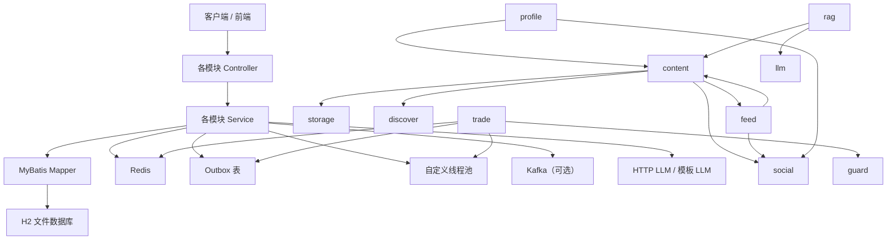

# 项目架构导读（当前代码版）

> 面向第一次阅读这个仓库的人。
> 重点不是背接口和代码细节，而是先建立一张“这个系统现在是怎么组织起来的”脑图。
> 本文以当前仓库里的 `src/main/java/com/zhiguang/be`、`src/main/resources` 和 `schema.sql` 为准；如果和 `README.md` 这类规划型文档有出入，以代码为准。

## 1. 先用一句话理解这个项目

这是一个基于 Spring Boot 的“模块化单体”后端项目，目标是做一个带有本地知识分享、附近发现、社交互动、轻量 AI 问答和交易能力的社区型平台。

从代码现状看，它不是“很多独立微服务”的结构，而是：

- 一个应用进程
- 一套统一的 Web / Security / 数据访问框架
- 多个按业务领域拆分的包模块
- Redis 承担大量高频状态、缓存和并发控制
- MyBatis + H2 承担当前默认持久化
- Kafka、HTTP LLM、更多异步链路是“可选能力”，不是默认必开

如果你第一次看这个项目，可以先把它理解成：

`一个以内容和社交为主线、用 Redis 做性能和一致性增强的 Spring Boot 单体系统`

## 2. 读这个项目前，先建立 5 个心智模型

### 2.1 它是“模块化单体”，不是微服务

所有核心业务都在同一个仓库、同一个 Spring Boot 应用里启动，模块之间主要通过 Java Service 调用协作，而不是通过 RPC。

这意味着：

- 好处是调试路径短，跨模块联调成本低
- 难点是需要靠包结构、分层和约定保持边界

### 2.2 统一分层是 `controller -> service -> mapper`

几乎所有业务模块都遵循这个结构：

- `controller`：对外 HTTP 接口
- `service`：业务编排和跨模块协作
- `mapper`：数据库访问
- `model` / `dto`：请求、响应和中间数据结构

第一次阅读时，最有效的方式通常不是“从 mapper 开始”，而是：

1. 先看 `controller` 暴露了什么能力
2. 再看 `service` 如何组织流程
3. 最后再看 `mapper/xml` 落库细节

### 2.3 Redis 在这里不只是缓存

这个项目里 Redis 的角色非常重，至少承担了这些职责：

- 本地/分布式缓存
- 登录风险控制
- Refresh Token 白名单
- 黑名单和限流
- GEO 附近搜索
- 热点探测
- 社交计数和位图
- 交易库存预扣和状态快照
- 分布式锁 / 轻量协调

所以读代码时，不要把 Redis 只当成“查不到数据库前面那层缓存”，它是很多业务快路径的一部分。

### 2.4 一致性策略偏向“先保证主链路，再做补偿”

项目里反复出现的做法是：

- 主事务先写数据库
- 必要时同步更新 Redis
- 额外动作通过 `afterCommit`、`outbox`、定时修复、可选 Kafka 消费来补偿

这是一种非常典型的“单体里先做弱事件化”的思路，适合从简单实现逐步演进到更复杂的异步架构。

### 2.5 默认运行形态比 README 里写的更“轻”

当前代码默认配置是：

- 数据库：H2 文件库
- Redis：本地 Redis
- Kafka：默认关闭关键业务消费链路
- LLM：默认模板模式，不走真实外部模型
- Spring Profile：默认 `business`

也就是说，这个仓库当前更像是“可本地跑通的完整后端骨架 + 若干已落地的高并发设计点”，而不是一个已经完全接入外部基础设施的生产系统。

## 3. 当前实现对应的技术栈

| 类别 | 当前代码中的实现 | 作用 |
| --- | --- | --- |
| 语言与运行时 | Java 21 | 主语言与运行时 |
| 应用框架 | Spring Boot 3.3.5 | 应用启动、IOC、Web、配置管理 |
| Web | `spring-boot-starter-web` | REST API |
| 安全 | Spring Security + OAuth2 Resource Server + JWT | 无状态认证鉴权 |
| 数据访问 | MyBatis + XML Mapper | 关系型数据库访问 |
| 默认数据库 | H2 文件数据库 | 本地默认持久化 |
| 缓存/状态 | Redis | 缓存、限流、GEO、计数、黑白名单、交易状态 |
| 消息队列 | Kafka（可选） | 社交计数聚合、交易异步链路的扩展能力 |
| 调度 | `@EnableScheduling` | 关单、修复、聚合刷新等定时任务 |
| 流式输出 | SSE | RAG 问答流式返回 |
| AI 接入 | Java `HttpClient` + 自定义 LLM Gateway | 可选 HTTP 模型调用 |
| 观测 | Spring Actuator | 健康检查与基础运行信息 |
| ID 生成 | Snowflake | 业务主键生成 |

## 4. 仓库的主干结构

### 4.1 启动与配置入口

- `src/main/java/com/zhiguang/be/ZhiguangBeApplication.java`
  应用启动入口，开启调度能力。
- `src/main/resources/application.yml`
  全局默认配置，定义数据库、Redis、Kafka、缓存、交易、社交、LLM 等参数。
- `src/main/resources/application-business.yml`
  默认业务 profile，线程池拒绝策略为 `caller-runs`。
- `src/main/resources/application-experiment.yml`
  实验 profile，线程池拒绝策略为 `count`。
- `src/main/resources/schema.sql`
  当前默认数据库初始化脚本。
- `pom.xml`
  整体依赖与构建定义。

### 4.2 主模块一览

`src/main/java/com/zhiguang/be` 下的核心模块可以分成三层来理解。

#### 业务主模块

| 模块 | 主要职责 |
| --- | --- |
| `auth` | 注册、登录、JWT、验证码、登录风险控制、刷新令牌、黑名单 |
| `content` | 内容草稿、内容确认、发布、删除、可见性管理 |
| `discover` | 附近内容发现，基于 Redis GEO |
| `feed` | 首页 Feed、缓存、个性化补全 |
| `social` | 关注、点赞、收藏、粉丝投影、计数体系 |
| `profile` | 个人主页、资料编辑、用户侧聚合视图 |
| `search` | 公共内容搜索与联想 |
| `llm` | 统一 LLM 网关、描述生成、回答组装 |
| `rag` | 轻量检索增强问答、SSE 输出 |
| `trade` | 活动、下单、支付、关单、库存预扣与补偿 |
| `storage` | 模拟预签名上传与公开资源 URL 处理 |

#### 基础支撑模块

| 模块 | 主要职责 |
| --- | --- |
| `common` | API 包装、异常体系、请求追踪、审计、Snowflake ID |
| `cache` | 本地缓存、Redis 访问封装、热点检测 |
| `guard` | 基于注解和 AOP 的限流能力 |
| `threadpool` | 自定义自适应缓冲线程池 |

#### 运维与辅助模块

| 模块 | 主要职责 |
| --- | --- |
| `platform` | 运行摘要、缓存清理 |
| `health` | 基础健康检查 |

## 5. 一张总图：模块之间怎么协作

这张图最重要的含义不是“谁依赖谁”本身，而是两个事实：

- 模块之间的协作主要发生在 Service 层
- Redis、Outbox、线程池是多个业务模块共享的基础能力

## 6. 核心数据模型：先认清几张关键表

### 6.1 用户与认证

- `users`
  当前主用户表，认证、资料、作者信息都围绕它展开。
- `login_logs`
  登录、注册、密码重置等认证行为审计日志。
- `auth_user`
  兼容历史结构的迁移表痕迹，当前主流程已经围绕 `users`。

### 6.2 内容与社交

- `know_posts`
  内容主表，包含作者、状态、可见性、摘要、地理位置信息等。
- `following`
  关注主表，代表“我关注了谁”的源数据。
- `follower`
  粉丝投影表，代表“谁关注了我”的投影结果。
- `like_favorite`
  点赞/收藏事实表。

### 6.3 交易与一致性

- `trade_activity`
  活动主表，描述价格、库存、开始结束时间等。
- `trade_order`
  订单主表。
- `outbox`
  通用补偿/事件外发表，多个模块都在用。

可以把这些表粗略分成三组：

- `users` 是“人”
- `know_posts` 是“内容”
- `following / follower / like_favorite` 是“关系”
- `trade_activity / trade_order` 是“交易”
- `outbox` 是“异步与补偿接口”

## 7. 跨模块基础设施

### 7.1 `common`：整个项目的公共底座

这是最值得先读的基础模块之一，因为很多其他模块都默认站在它上面。

它主要提供：

- 统一返回结构：`ApiResponse`
- 统一错误结构：`ErrorResponse`
- 统一业务异常：`BusinessException` + `ErrorCode`
- 全局异常处理：`GlobalExceptionHandler`
- 请求追踪：`RequestIdFilter`
- API 审计：`ApiAuditInterceptor`
- 雪花 ID：`SnowflakeIdGenerator`

这意味着你在其他模块里看到的很多“为什么 controller 这么干净”“为什么异常不用一层层捕获”“为什么每个请求都有 requestId”，答案都在这里。

### 7.2 `cache`：不是简单工具类，而是一套缓存策略层

`cache` 模块做了两件事：

1. 给业务模块提供统一的本地缓存 + Redis 访问接口
2. 提供热点识别能力

它的核心价值在于把项目里常见的缓存需求统一起来：

- 本地缓存
- Redis JSON/String 读写
- 批量读写
- 模式删除
- 热 key 探测与 TTL 延长

`feed`、`discover`、`trade` 都依赖这层能力。

### 7.3 `guard`：统一限流入口

`guard` 很小，但很关键。它用：

- 注解 `@RateLimiter`
- AOP 切面
- Redis ZSet + Lua

实现了滑动窗口限流。

这不是一个“只给某个模块临时用一下”的类，而是一个可复用的横切能力。当前交易下单接口已经显式接入了它。

### 7.4 `threadpool`：面向业务的异步执行器

这个模块不是直接使用 Spring 默认线程池，而是自己实现了一套自适应缓冲线程池。

当前主要暴露两个执行器：

- `tradeOrderExecutor`
- `ragQueryExecutor`

它说明这个项目对“高峰时如何退让、如何统计拒绝、如何做实验 profile”是有明确设计意图的，而不是把异步执行随便交给默认线程池。

### 7.5 `platform` / `health`：运行态观察与轻运维

这两个模块比较轻，但对新同学很友好：

- `health` 提供基础存活检查
- `platform` 提供运行摘要
- `platform` 还提供缓存清理入口

如果你想快速判断“这个仓库到底默认开启了哪些能力”，`platform` 模块是一个很好的观察点。

## 8. 业务模块详解

下面按“新人最容易建立业务图景”的方式来分组。

## 8.1 用户与安全域

### `auth`：认证与会话控制中心

这是项目里实现最完整的模块之一。

它负责：

- 发送验证码
- 注册
- 登录
- 刷新 Token
- 注销
- 密码重置
- 当前用户信息

它背后的关键技术点是：

- Access Token + Refresh Token 双令牌
- RSA JWT
- Refresh Token 白名单存 Redis
- 刷新时做原子轮换
- 登录失败计数与风控阈值
- 验证码存 Redis
- 登录黑名单 / Token 拉黑
- 认证行为日志写入 `login_logs`

这个模块非常适合作为“理解整个项目编码风格”的样板：

- controller 很薄
- 业务都进 service
- 风控、黑白名单、token 存储被拆成独立协作者

### `profile`：用户资料聚合层

`profile` 不是单纯 CRUD 用户表，它更像一个“用户视角 BFF”。

它把下面几类信息聚合到一起：

- `users` 基础资料
- 社交计数与关系状态
- 用户已发布内容
- 头像地址规范化
- 关注列表 / 粉丝列表视图

所以读 `profile` 时要有一个预期：

- 它本身不一定拥有很多底层规则
- 它更像把 `auth`、`social`、`content`、`storage` 的结果拼成一个对外更友好的用户模型

## 8.2 内容与分发域

### `storage`：存储适配层

当前实现是一个“模拟对象存储接入层”，主要做这些事：

- 生成 mock 的预签名上传 URL
- 生成公开访问 URL
- 校验资源类型
- 约束内容文件、图片、头像对象 key 的归属关系

它的意义在于把“文件上传”与“内容发布”解耦。内容模块不直接关心对象存储细节，而是通过 `storage` 获取上传地址和 URL 规范化能力。

### `content`：内容生命周期主模块

`content` 可以理解成“内容主表和状态机”。

它大致管理这些状态：

- 草稿
- 正文已确认
- 元数据已完成
- 已发布
- 已删除

它负责的能力包括：

- 创建草稿
- 确认上传内容
- 更新标题、标签、位置等元数据
- 发布
- 删除
- 可见性控制
- 置顶
- 公共列表 / 我的列表 / 用户发布列表 / 详情

这个模块最值得学习的点不在 CRUD，而在“发布后如何联动其他模块”：

- 发布后同步维护发现索引
- 发布/删除/可见性变化后失效 Feed 缓存
- 写 `outbox` 作为后续补偿接口
- 明细查询会聚合互动信息和作者信息

换句话说，`content` 是系统里最像“业务主轴”的模块之一。

### `discover`：基于地理位置的发现能力

`discover` 是当前代码里一个非常有辨识度的模块，因为它不是走数据库地理查询，而是重度依赖 Redis GEO。

它的核心设计是：

- 内容发布时写入 GEO 索引
- 搜索时按位置、半径、分页做附近发现
- 使用 GeoHash / 半径 / 页码组合构建缓存键
- 对结果做距离、时间、热度的混合排序
- 用 Redis 锁防止缓存重建击穿

这个模块说明项目在“附近内容发现”上更偏实时和缓存友好，而不是一开始就引入复杂搜索引擎。

### `feed`：首页内容分发与缓存中心

`feed` 的核心问题不是“怎么查出列表”，而是“怎么把首页做快”。

它用了多层缓存和后置个性化：

- 本地页面缓存
- Redis 页面缓存
- Redis 片段/卡片缓存
- single-flight 防止同一请求并发回源
- HotKey 探测与动态延长 TTL

同时，它还把“公共部分”和“用户相关部分”分开处理：

- 先缓存通用 Feed 页面
- 命中后再补充当前用户是否点赞、是否收藏、作者关系状态等个性化字段

这是一个很值得学习的设计点，因为它兼顾了缓存命中率和用户态信息。

### `search`：当前版本是“数据库搜索”，不是 ES

如果只看仓库里其他文档，很容易以为搜索已经是 Elasticsearch 方案；但按当前代码看，`search` 仍然是：

- 基于数据库查询公共帖子
- 支持关键词和标签
- 支持 `searchAfter` 风格游标
- 支持联想建议

也就是说，`search` 模块现在更像一个“先把搜索接口抽出来”的基础版本，方便以后替换底层实现。

## 8.3 社交域

### `social`：关注、点赞、收藏和计数的集中地

`social` 是这个项目里内部结构最丰富的模块之一，可以拆成 4 条线来看。

#### 1. 关注关系

- `following` 是源数据
- `follower` 是投影表
- 关注/取关会写数据库并写 outbox
- 本地可选投影处理器会在事务提交后同步修正粉丝视图
- Redis ZSet 用来承载关注/粉丝列表缓存

这体现了一个很重要的设计思想：

`关注是源关系，粉丝是为了查询效率建立的投影`

#### 2. 点赞/收藏事实

- 事实仍然保存在 `like_favorite`
- 用户态和目标态的读取会做批量聚合
- 通过 Redis 位图和计数快照提升高频读写性能

#### 3. 用户社交计数

计数系统不是简单 `INCR` 几个 key，而是做了更底层的数据布局：

- 使用固定 schema 的 Redis 二进制字符串
- 记录关注数、粉丝数、发帖数、获赞数、被收藏数等
- 用 Lua 做原子增减
- 提供一致性校验和重建能力

这块代码很值得深挖，因为它体现了项目对“热点计数存储效率”和“修复能力”的考虑。

#### 4. 可选 Kafka 聚合链路

当前代码保留了 Kafka 消费者：

- 社交计数聚合消费
- 计数重建消费

但默认配置下并不是核心主链路必开。这意味着：

- 设计上已经为异步化留好了入口
- 默认本地运行仍可依靠 Redis + 定时刷新 + 本地处理完成闭环

## 8.4 AI 与问答域

### `llm`：统一模型调用门面

`llm` 模块的定位是“统一 LLM 接入”，而不是直接把外部模型调用散落到业务代码中。

当前支持两种模式：

- `template`
  默认模式，不依赖外部真实模型
- `http`
  通过配置的 HTTP Endpoint 调用外部模型

它目前主要服务两件事：

- 生成帖子描述
- 为 RAG 组装回答

这里最值得注意的是项目的态度非常务实：

- 默认先让系统在没有外部模型时也能跑
- 等真实模型准备好，再切到 HTTP Provider

### `rag`：轻量版 RAG，不是重型向量检索系统

当前 `rag` 的实现重点是“接口和流程成立”，不是“底层向量库已经完整落地”。

它目前做的是：

- 把帖子信息切成若干 chunk
- 在内存中维护轻量索引
- 按问题做简单打分召回
- 调用 `llm` 生成回答
- 通过 SSE 流式输出

所以看这个模块时，正确预期应该是：

- 它已经定义好了 RAG 的上层 API 形状
- 但底层索引目前还是轻量版本
- 后续可以替换为真正的向量检索，而不用重写上层接口

## 8.5 交易域

### `trade`：高并发交易能力的实验场

`trade` 是另一个很值得深入看的模块，因为它几乎把这个项目的高并发工具箱都用了起来。

它负责：

- 活动创建
- 活动列表与详情
- 下单
- 支付
- 主动取消
- 订单状态查询
- 我的订单列表
- 超时关单

它的核心设计不是“普通订单系统”，而是偏秒杀/抢购风格：

- Redis Lua 预扣库存
- Redis 记录用户维度下单占用
- 分布式提交锁防重
- 成功后异步落单
- 可选 Kafka，也可回退到本地线程池执行
- 数据库侧再做最终库存扣减与订单创建
- 失败或超时后做补偿回写 Redis
- 通过 `outbox` 记录 Redis 同步补偿任务

所以 `trade` 模块体现出来的是：

`先让入口非常快，再用异步和补偿把最终一致性兜住`

如果你想研究这个仓库里最“工程化”的部分，`trade`、`social`、`feed` 是最值得精读的三块。

## 9. 这个项目里反复出现的技术模式

把这些模式看懂，很多模块会一下子顺起来。

### 9.1 Cache Aside + 精细化失效

出现在 `feed`、`discover`、`trade` 等模块里。

不是只做“查缓存，miss 查库，再写缓存”，而是会结合：

- 页面缓存
- 片段缓存
- 本地缓存
- 延迟双删
- 热 key 延长 TTL

### 9.2 Redis Lua 做原子业务动作

出现在：

- Refresh Token 轮换
- 验证码消费
- 关注限流
- 社交计数
- 交易库存预扣
- 分布式锁释放

这说明项目倾向于把“需要原子性的一小段业务逻辑”直接下推到 Redis，而不是完全依赖 Java 侧多次往返。

### 9.3 `afterCommit` 触发跨模块后置动作

多个模块都在事务提交后做额外处理，比如：

- 失效缓存
- 触发本地投影
- 同步 Discover 索引

这是单体架构里一种非常实用的“轻事件化”手段。

### 9.4 Outbox 作为异步与补偿接口

`outbox` 在这个项目里的意义不是“已经完全事件驱动了”，而是：

- 给未来 Kafka/异步链路预留边界
- 给失败重试、补偿修复留抓手
- 把“主事务完成”和“副作用外发”尽量解耦

### 9.5 读模型与写模型分离

最典型的是社交关系：

- `following` 适合写
- `follower` 适合读

这是一个非常好的领域建模例子。

### 9.6 用户态后补全

`feed`、`content` 明细都不是把所有信息都硬塞进主查询里，而是：

- 先取主内容
- 再补充互动汇总、关系状态、作者统计

这样更利于缓存和模块解耦。

### 9.7 可选外部依赖开关

当前项目很多增强能力都做成配置开关，例如：

- 是否启用 Kafka 聚合
- 是否启用社交修复任务
- 是否启用真实 HTTP LLM

这使得它很适合作为“可以逐步演进”的项目骨架。

## 10. 按主链路理解系统

第一次阅读时，不一定要按模块逐个死抠。更高效的方法是先看 5 条主链路。

### 10.1 注册 / 登录链路

主线是：

1. `auth` 校验验证码或密码
2. 结合 Redis 做登录风控
3. 生成 Access / Refresh Token
4. 把 Refresh Token 标识写入 Redis 白名单
5. 写登录日志

读懂这条链路后，你会同时理解：

- Spring Security 在这里怎么配
- JWT 是怎么签发和校验的
- Redis 在认证体系里承担什么职责

### 10.2 发帖发布链路

主线是：

1. `storage` 生成上传 URL
2. `content` 创建草稿
3. 客户端上传完成后由 `content` 确认内容
4. `content` 补全元数据并发布
5. 发布后同步更新 `discover`
6. 触发 `feed` 缓存失效
7. 写入 `outbox`

读懂这条链路后，内容、发现、首页分发三块就能连起来。

### 10.3 首页 Feed 链路

主线是：

1. `feed` 先查本地缓存 / Redis 页面缓存
2. miss 时回源数据库拿公共内容
3. 如有位置参数，叠加距离因素做混排
4. 命中或回源后补充用户态互动信息
5. 把结果写回多级缓存

这条链路最能体现项目的性能思路。

### 10.4 关注 / 点赞 / 收藏链路

主线是：

1. `social` 先更新事实或关系数据
2. 关系类操作可能写投影和缓存
3. 计数类操作更新 Redis 位图 / 计数结构
4. 必要时通过 outbox / Kafka / 定时任务做聚合刷新或修复

这条链路能让你理解这个项目为什么要设计 `following` 和 `follower` 两张表。

### 10.5 下单链路

主线是：

1. `trade` 先做入口限流
2. Redis Lua 预扣库存并校验资格
3. 快速返回“受理中”或直接给提交结果
4. 异步落单到数据库
5. 失败时补偿 Redis 占用
6. 超时未支付时自动关单并回补库存

这条链路体现的是项目对高并发交易的思考方式，而不是单纯订单 CRUD。

## 11. 配置与运行模式：哪些能力默认开启，哪些不是

这是第一次上手时特别容易误判的一点。

### 11.1 默认一定会生效的

- `spring.profiles.default=business`
- H2 文件数据库初始化
- MyBatis XML 映射
- Redis 连接
- 调度任务能力
- Security/JWT 体系
- 自定义线程池配置

### 11.2 默认是关闭或轻量替代的

- `trade.kafka.enabled=false`
- `social.counter.kafka.enabled=false`
- `social.relation.repair.enabled=false`
- `llm.provider=template`

这意味着当前系统的默认姿势是：

- 交易链路优先走本地异步执行
- 社交聚合不强依赖 Kafka
- RAG 默认不依赖真实外部模型

### 11.3 `business` 与 `experiment` 的区别

当前最直接的差异是线程池拒绝策略：

- `business`：`caller-runs`
- `experiment`：`count`

所以这两个 profile 更像“并发行为实验开关”，不是整套业务能力的切换。

## 12. 给第一次读项目的人一个推荐顺序

如果你想在最短时间内建立全局理解，我建议按下面顺序。

### 第一轮：先看整体框架

1. `ZhiguangBeApplication`
2. `application.yml`
3. `schema.sql`
4. `common`

这一轮的目标不是记细节，而是搞清楚：

- 应用怎么启动
- 配置中心在哪里
- 数据表有哪些
- 接口的统一风格是什么

### 第二轮：先打通用户与内容主线

1. `auth`
2. `storage`
3. `content`
4. `profile`

这一轮结束后，你会知道：

- 用户怎么登录
- 内容怎么发布
- 用户主页如何聚合

### 第三轮：再看分发与社交

1. `discover`
2. `feed`
3. `social`
4. `search`

这一轮是理解“内容发出来以后怎么被消费”的关键。

### 第四轮：看 AI 和交易

1. `llm`
2. `rag`
3. `trade`

这一轮适合在你已经理解内容和社交后再看，否则会觉得上下游背景不足。

### 第五轮：看基础性能与运维

1. `cache`
2. `guard`
3. `threadpool`
4. `platform`
5. `health`

这时候你再回头看，会更容易明白这些基础设施为什么长成现在这样。

## 13. 新人最容易踩的 4 个理解误区

### 误区 1：README 里写的就是当前实现

不完全是。

README 更像“项目蓝图 + 目标架构”，当前代码则更偏“已经能运行的实现版本”。尤其是在：

- 数据库选型口径
- 搜索/RAG 的底层实现
- Kafka 链路是否默认开启

这些点上，一定要以代码和配置为准。

### 误区 2：搜索和 RAG 已经是重型引擎方案

不是。

当前代码里：

- `search` 还是数据库检索版本
- `rag` 是内存轻量索引版本

它们已经把 API 和分层立住了，但底层仍保留未来演进空间。

### 误区 3：Redis 只是缓存

不是。

在这个项目里 Redis 同时承担了状态机、锁、限流器、白名单、位图、GEO、库存预占和计数系统等职责。

### 误区 4：`social` 只是点赞关注接口集合

也不是。

`social` 其实承载了：

- 关系建模
- 读写分离投影
- 高并发计数
- 位图状态
- Kafka 聚合接口
- 修复任务

它是一个“系统设计浓度”很高的模块。

## 14. 如果你只想挑最有代表性的代码读

推荐优先看这几块：

- `auth`：看项目的基本分层和安全体系
- `content`：看业务主轴如何联动多个模块
- `feed`：看缓存与个性化补全
- `social`：看关系建模和高并发计数
- `trade`：看 Redis 预扣、异步落单和补偿
- `threadpool`：看项目对并发控制的工程化处理

## 15. 最后给这套架构一个总评价

从当前代码看，这个项目最鲜明的特点不是“技术特别重”，而是“演进路线很明确”。

它已经把下面这些关键问题都考虑进去了：

- 如何用模块化单体组织复杂业务
- 如何让 Redis 参与高频业务快路径
- 如何用 outbox、补偿和定时任务处理一致性
- 如何给 Kafka、真实 LLM、重型搜索留扩展点
- 如何让系统在没有全部外部基础设施时也能本地跑起来

所以第一次读这个项目，最重要的不是把每个类都看完，而是先看懂这三件事：

1. 业务主线是什么
2. Redis 和数据库分别承担什么角色
3. 哪些模块是“当前已完整实现”，哪些模块是“已经立好接口、等待继续演进”

只要这三件事建立起来，后面再往下钻某个模块，理解成本会低很多。
